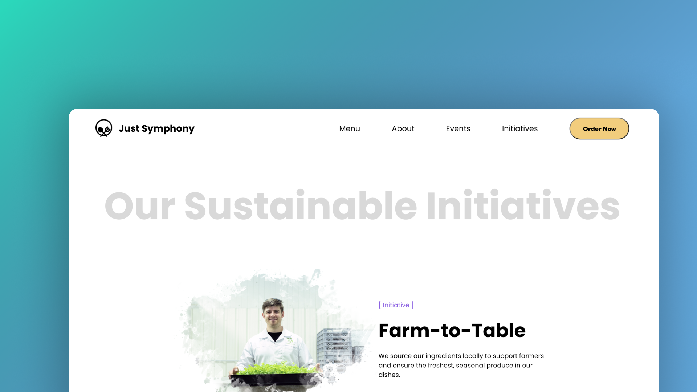
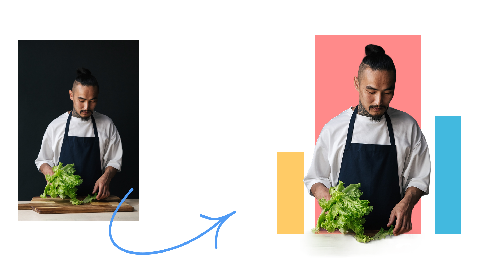
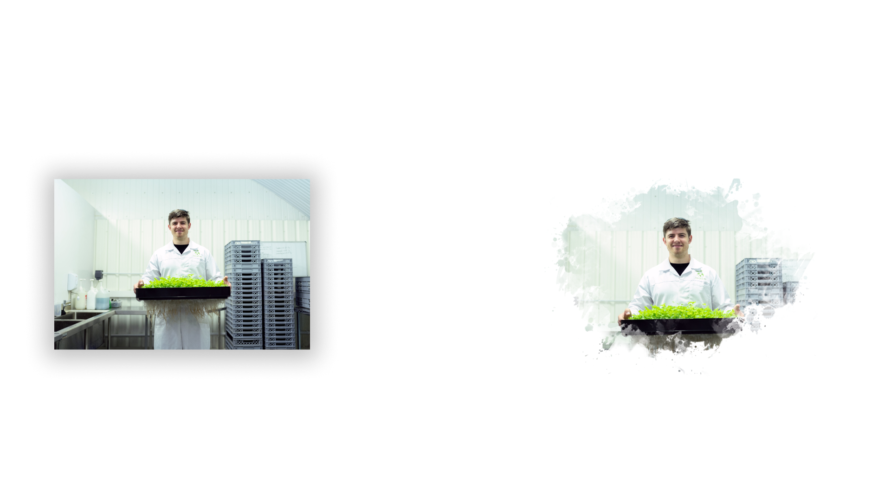

## Resto

[](https://app.deepsource.com/gh/siddhantprateek/resto/)
[](https://app.deepsource.com/gh/siddhantprateek/resto/)
[](https://app.deepsource.com/gh/siddhantprateek/resto/)

> Restaurant App - It's not just food , It's an experience. 😇



[Code Coverage Report](https://app.deepsource.com/report/dc8ba39c-391c-4491-8598-77342accbd1f)

## Tech Stack

- `React`
- `Typescript`
- `Mirage Js` - Mock Server 

## Objective 

- Within the menu, users have the option to filter items by searching for tag values or by conducting a regular search using item names. While the current selection of tags does not facilitate the desired data query, users can achieve a similar outcome through the search bar.

## Setting up project for development using `Docker`

- To run the application locally, you have two options: either create the Docker image using `Dockerfile` or utilize `docker-compose`. Ensure that Docker is installed on your local machine.  Or Visit [Install Docker](https://docs.docker.com/engine/install/)

```bash
docker build -t resto-web . 
# or
docker-compose up -d
```
> _If prefer cloning the repository and run locally then follow bellow steps_

```bash
git clone https://github.com/siddhantprateek/resto
cd resto
npm install | bun install # install dependenies(npm or bun)
npm run start # run the react application on port 3000
```


## API Documentation

- The base URL for api is `https://restaurant.service/api`

 
| Endpoint | API Description | 
| -------- | -------- | 
| `GET /all`     | Fetch entire restaurant data     | 
| `GET /chef`    | Fetch chef details containing `name`, `bio` and `signature_dist`    | 
| `GET /awards`     | Retrieves Array of Awards(`award`, `origanization`, `year`)     | 
| `GET /ambinence`     | Retrieves about restaurant ambinence description    | 
| `GET /food/menu`     | Fetch all the food Items     | 
| `GET /initiatives`     | Retrieves all Initiative taken by restaurant     | 
| `GET /reviews`     | Fetch customer reviews(`customer_name`, `comment`, `rating`)   | 
| `GET /events`     | Fetch Upcoming Events(`name`,`date`, `description`)    | 
| `GET /website`     | Fetch website Url   | 
| `GET /socials`     | Fetch All online presence Urls (`facebook`, `Instagram`, `Twitter`)   | 


## Website Navigation routes

- The Application is deployed on Vercel - [Website](https://resto-steel.vercel.app)

| `URl: https://resto-steel.vercel.app/` | `Description` |
| -------- | -------- | 
| `PATH /`     | Home Page     | 
| `PATH /about`     | Details about Restaurant and Chef     | 
| `PATH /menu`     | Shows All the Available Food Items     | 
| `PATH /events`     | Shows all the Upcoming Events     | 
| `PATH /initiatives`     | Shows All the initiatives taken by Restaurant for Sustainability     | 
| `PATH /recipes`     | Shows detailed Food Items   | 


## Application Folder structure

- Inside Source folder `src`
```bash
.
├── App.css
├── App.test.tsx
├── App.tsx # application Entry point
├── assets # assets used in components and pages
├── components # All Components
│   ├── common # All repeated Components
│   ├── footer
│   ├── header
│   ├── hero
│   ├── index.ts # components default export
│   └── reservations
├── context # !Not Used, contains Global Context
├── data 
│   └── restaurantData.json # dummy data
├── index.css
├── index.tsx
├── mirage # mock server
├── pages # contains all routing pages

```

## Custom-made Assets Samples





## Author 

[Siddhant Prateek Mahanayak](https://github.com/siddhantprateek)
